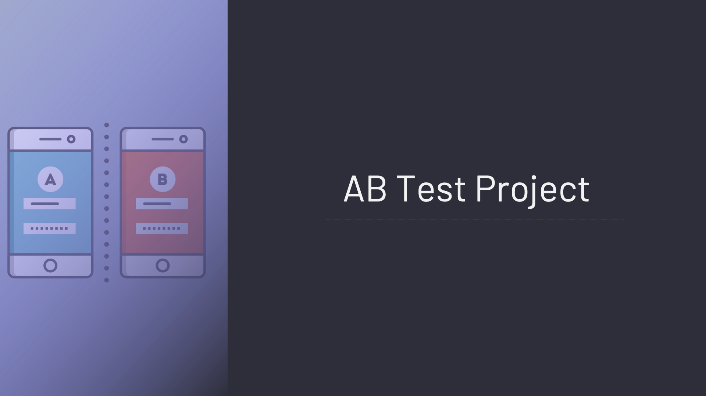

# AB_TEST

# Business Problem  Purpose

Facebook recently introduced a new bidding type, "average bidding", as an alternative to the existing bidding type called "maximumbidding".

 One of our clients has decided to test this new feature and wants to run an A/B test to see if average bidding brings more conversions than maximumbidding. The A/B test has been running for 1 month and the company is now asking you to analyze the results of this A/B test. 

The ultimate measure of success for our client is Purchase. Therefore, the focus should be on the Purchase metric for statistical testing.

* Preparing and analyzing data

* Defining the Hypothesis of the A/B Test
* Conducting Hypothesis Testing
*  Analysis of Results
